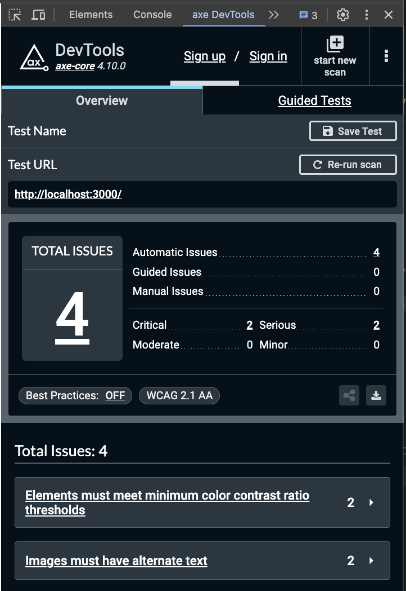

# Otaniemi Fight Club landing page

## Production environments

The website is available at <a href="https://classy-fairy-d41d66.netlify.app/english/" target="_blank">https://classy-fairy-d41d66.netlify.app/english/</a>

The Strapi CMS admin panel is available at <a href="https://informed-idea-cad3b2a8dd.strapiapp.com/admin " target="_blank">https://informed-idea-cad3b2a8dd.strapiapp.com/admin</a>

## Running the app in Docker

Create the required `.env` files at the root of the project, in the `cms`folder and in the `frontend` folder.

Make sure you have Docker Compose installed and run

```shell
docker-compose up
```

The frontend client is available at <a href="http://localhost:3000/" target="_blank">http://localhost:3000/</a>

## Local Strapi development

By default the frontend connects to the Strapi running live at [https://informed-idea-cad3b2a8dd.strapiapp.com](https://informed-idea-cad3b2a8dd.strapiapp.com)

If you wish to run Strapi locally, e.g. for testing content type changes, run `npm install` in the `cms` folder and then `npm run strapi develop`

Then you can log into the Strapi admin panel at <a href="http://localhost:1337/admin" target="_blank">http://localhost:1337/admin</a>

Finally, connect the frontend temporarily to the local Strapi endpoint by setting the `STRAPI_URL` value in `frontend/src/lib/strapi.ts` to `http://localhost:1337`

See Strapi admin panel use instructions at `assets/Strapi Instructions.pdf`

> **Warning**
> COLLECTION AND SINGLE TYPE ENTRIES (e.g. any collection members created in Strapi) ARE STORED ONLY LOCALLY!

## Testing

Enable the <a href="https://chromewebstore.google.com/detail/axe-devtools-web-accessib/lhdoppojpmngadmnindnejefpokejbdd?utm_source=deque.com&utm_medium=referral&utm_campaign=axe-browser-extensions_hero&pli=1" target="_blank">axe DevTools Chrome extension</a> when developing the frontend.

Open the axe DevTools tab in Chrome DevTools and run the _Full Page Scan_ to check for accessibility issues to fix them accordingly.



## Typechecking

To check for TypeScript violations, run

```shell
npm run tsc
```

## Code formatting

Format code according to rules specified in `.prettierrc` by running

```shell
npx prettier . --write
```

You can also install the <a href="https://marketplace.visualstudio.com/items?itemName=esbenp.prettier-vscode" target="_blank">Prettier VSCode extension</a> to format code on save
